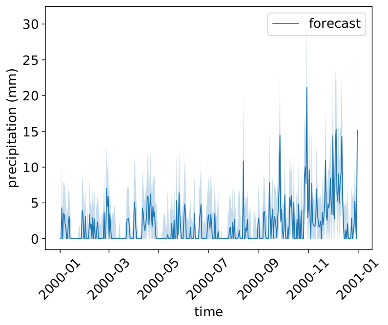

# Precipitation Forecasting using Compound Poisson Time Series
* Copyright (c) 2019-2021 Sherman Lo
* MIT LICENSE

[](https://zenodo.org/badge/latestdoi/301799941)

Concept code for predicting precipitation using model fields (temperature, geopotential, wind velocity, etc.) as predictors for sub-areas across the British Isle. A Bayesian inference was used to quantify uncertainty in the forecasting.

The documentation is designed for Linux users only.

Please see LICENCE for further information on how you can use and modify this repository for your own purpose.



Keywords: *Compound Poisson, MCMC sampling, time series, precipitation, weather forecasting*

## Requirements (Python 3, Linux Recommended)
* At least 16 GB of RAM
* `numpy`
* `pandas`
* `scipy`
* `matplotlib`
* `statsmodels`
* `joblib`
* `cartopy`
    * [Installation instructions](https://scitools.org.uk/cartopy/docs/latest/installing.html)
    * [Possible help when installing](https://stackoverflow.com/questions/1099981/why-cant-python-find-shared-objects-that-are-in-directories-in-sys-path)
* `netCDF4`
    * [Installation instructions](https://unidata.github.io/netcdf4-python/netCDF4/index.html)
* `cftime`
    * ~~Must be *version 1.0.4.2* because future releases change the use of num2date, see the [change log](https://github.com/Unidata/cftime/blob/master/Changelog) for further details.~~
* `gdal`
    * [Installation instructions](https://mothergeo-py.readthedocs.io/en/latest/development/how-to/gdal-ubuntu-pkg.html)
    * [Possible help when installing](https://gis.stackexchange.com/questions/28966/python-gdal-package-missing-header-file-when-installing-via-pip)
* `mpi4py`
    * Requires [MPICH](https://www.mpich.org/)

## Download the Data
The data is available on [FigShare](https://figshare.com/s/c881cb81eff6942a61ac). Please download and extract the files so that the directories are as follow:
- `Data/ana/`
- `Data/eobs/`
- `Data/era5/`
- `Data/topo/`

## Summary of the Repository
All code which reads and processes the data are stored in the package `dataset`. All statistical code are in the package `compound_poisson`. Scripts to reproduce results or to play with a toy model are in the directory `script`.

The packages `dataset` and `compound_poisson` will need to be `import`-ed and accessible in order to run scripts. This can be done, for example, by adding to the `~/.bashrc` file
```
PYTHONPATH=[path to repository]:$PYTHONPATH
export PYTHONPATH
```
where `[path to repository]` is to be replaced with the path to a local copy of this repository. This makes the repository accessible by Python on start up of the computer.

It is recommended to run scripts from the location of the scripts, eg
```
cd script
cd cardiff_5_20
python3 hyper_slice.py
```
so that all relevant results and figures are stored in `script/cardiff_5_20/`.

Please see `README.md` files in the packages for further information.

## Single Location Scripts
* `script/london`
    * Training set: 1980-1989 inclusive
    * Test set: 1990-1999 inclusive
* `script/cardiff_1_20`
    * Training set: 1999
    * Test set: 2000-2019 inclusive
* `script/cardiff_5_20`
    * Training set: 1995-1999 inclusive
    * Test set: 2000-2019 inclusive
* `script/cardiff_10_20`
    * Training set: 1990-1999 inclusive
    * Test set: 2000-2019 inclusive
* `script/cardiff_20_20`
    * Training set: 1979-1999 inclusive
    * Test set: 2000-2019 inclusive

To reproduce the results, run the script `hyper_slice.py` followed by `hyper_slice_forecast.py`. Figures are plotted and saved in the `figure` directory.

Results are saved in the `result` directory. When results from previous runs are detected, it will resume the run up to the provided number of samples. Delete the directory if you wish to restart the sampling process from the start.

Options are provided which may be useful for development, debugging or check-pointing purposes.

- `python3 hyper_slice.py [--sample [nsample]]`
    - `--sample nsample`: Run MCMC until `nsample` posterior samples are obtained.

- `python3 hyper_slice_forecast.py [--sample [nsample]] [--burnin [burnin]] [--noprint]`
    - `--sample nsample`: Run posterior predictions until `nsample` predictive samples are obtained.
    - `--burnin burnin`: Set the burn-in to `burnin`. Otherwise, uses the default value.
    - `--noprint`: Do not print figures.

The following examples are provided:

* `python3 hyper_slice.py`
    * Does the default number of MCMC samples
    * If MCMC samples are detected from a previous run, only print out figures
* `python3 hyper_slice.py --sample 10000`
    * Does 10000 MCMC samples
* `python3 hyper_slice.py --sample 10000` followed by `python3 hyper_slice.py --sample 20000`
    * Does 10000 MCMC samples, save the samples, then does 20000 more MCMC samples
* `python3 hyper_slice_forecast.py`
    * Does the default number of forecast samples
    * If forecast samples are detected from a previous run, only print out figures
* `python3 hyper_slice_forecast.py --sample 500`
    * Does 500 forecast samples
* `python3 hyper_slice_forecast.py --sample 500` followed by `python3 hyper_slice_forecast.py --sample 1000`
    * Does 500 forecast samples, save the samples, then does 1000 more forecast samples
* `python3 hyper_slice_forecast.py --sample 500 --burnin 100`
    * Does 500 forecast samples with a burn in of 100. If `--burnin` is not provided, the default burn in is used.

## Other Single Location Scripts
* `script/cardiff_era5/era5.py`
    * IFS prediction on the test set: 2000-2019 inclusive
* `script/cardiff_plot/plot.py`
    * Compare the AUC, bias loss and residuals of the MCMC forecast with IFS.
* `script/cardiff_plot/plot_dist.py`
    * Compare the distribution of the MCMC forecast with IFS.

## Multiple Locations Scripts
* `script/isle_of_man`
    * Training set: 1990-1999 inclusive
    * Test set: 2000-2009 inclusive
* `script/wales_5_20`
    * Training set: 1995-1999 inclusive
    * Test set: 2000-2019 inclusive

To reproduce the results, run the script `multiseries.py` to do MCMC sampling. 20,000 MCMC samples are required to reproduce the results. This is programmed to be the default but should be noted if one wants to checkpoint during a run. Afterwards, run the script `multiseries_forecast.py` to do forecasting. Figures are plotted and saved in the `figure` directory.

The scripts `multiseriesgp.py` and `multiseriesgp_forecast.gp` are versions with GP smoothing when forecasting.

Results are saved in the `result` directory. When results from previous runs are detected, it will resume the run up to the provided number of samples. Delete the directory if you wish to restart the sampling process from the start.

These scripts uses multiple threads so using a multi-core processor(s) is recommended. By default, [`multiprocessing.Pool`](https://docs.python.org/3/library/multiprocessing.html) is used. Changing what parallel computation package to use can be done by modifying the code. For example, one can modify
```
pool = multiprocess.Pool
```
to
```
pool = multiprocess.MPIPoolExecutor
```
so that [`mpi4py.futures.MPIPoolExecutor`](https://mpi4py.readthedocs.io/en/stable/mpi4py.futures.html) is used. In addition, the module `-m mpi4py.futures` and the script should be run using MPI, for example `mpiexec` or `srun`.

Options are provided which may be useful for development, debugging or check-pointing purposes.

- `[mpiexec] python3 [-m mpi4py.futures] multiseries.py [--sample [nsample]]`
    - `--sample nsample`: Run MCMC until `nsample` posterior samples are obtained.
    - `[mpiexec]` and `-m mpi4py.futures` required only if using `MPIPoolExecutor`

- `[mpiexec] python3 [-m mpi4py.futures] multiseries_forecast.py [--sample [nsample]] [--burnin [burnin]] [--noprint]`
    - `--sample nsample`: Run posterior predictions until `nsample` predictive samples are obtained.
    - `--burnin burnin`: Set the burn-in to `burnin`. Otherwise, uses the default value.
    - `--noprint`: Do not print figures.
    - `[mpiexec]` and `-m mpi4py.futures` required only if using `MPIPoolExecutor`

The following examples are provided:

* `python3 multiseries.py`
    * Does the default number of MCMC samples
    * If MCMC samples are detected from a previous run, only print out figures
* `python3 multiseries.py --sample 10000`
    * Does 10000 MCMC samples
* `python3 multiseries.py --sample 10000` followed by `python3 multiseries.py --sample 20000`
    * Does 10000 MCMC samples, save the samples, then does 20000 more MCMC samples
* `python3 multiseries_forecast.py`
    * Does the default number of forecast samples
    * If forecast samples are detected from a previous run, only print out figures
* `python3 multiseries_forecast.py --sample 500`
    * Does 500 forecast samples
* `python3 multiseries_forecast.py --sample 500` followed by `python3 multiseries_forecast.py --sample 1000`
    * Does 500 forecast samples, save the samples, then does 1000 more forecast samples
* `python3 multiseries_forecast.py --sample 500 --burnin 100`
    * Does 500 forecast samples with a burn in of 100. If `--burnin` is not provided, the default burn in is used.

## Other Multiple Locations Scripts
* `script/wales_era5/era5.py`
    * IFS prediction on the test set: 2000-2019 inclusive
* `script/wales_5_20/multiseries_compare.py`
    * Compare the AUC, bias loss and residuals of the MCMC forecast with IFS.
    * Compare the distribution of the MCMC forecast with IFS.
    * Compare the cross correlation of the MCMC and IFS forecast as well as the observed.

## Further Documentation
* Please see the packages [`compound_poisson`](./compound_poisson/) and [`dataset`](./dataset/) for further documentations.

## Notes on Development and Sustainability
- The code shall be lightly maintained with more small examples added.
- Legacy copy where the parameters have a Gaussain process prior are left in here (see for example `compound_poisson/downscale.py`).
- The author has a background in Java so there is a frequent use of classes and inheritance structure.
- The author attempted to keep to the [Google Python style guide](https://google.github.io/styleguide/pyguide.html). There are a few omission such as underscores for denoting private and protected methods, variables and classes.
