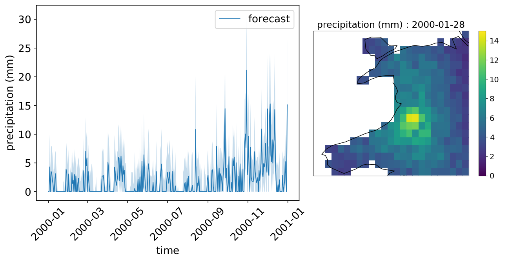

# Precipitation Forecasting using Compound Poisson Time Series
* Copyright (c) 2020 Sherman Lo
* MIT LICENSE

Concept code for predicting precipitation using model fields (temperature, geopotential, wind velocity, etc.) as predictors for sub-areas across the British Isle. A Bayesian inference was used to quantify uncertainity in the forecasting.

Please see LICENCE for further information on how you can use and modify this repository for your own purpose.



Keywords: *Compound Poisson, MCMC sampling, downscale, time series, Gaussian process, downscaling, precipitation, weather forecasting*

## Requirements (Python 3, Linux Recommended)
* At least 16 GB of RAM
* `numpy`
* `pandas`
* `scipy`
* `matplotlib`
* `statsmodels`
* `joblib`
* `pupygrib`
* `cartopy`
    * [Installation instructions](https://scitools.org.uk/cartopy/docs/latest/installing.html)
    * [Possible help when installing](https://stackoverflow.com/questions/1099981/why-cant-python-find-shared-objects-that-are-in-directories-in-sys-path)
* `netCDF4`
    * [Installation instructions](https://unidata.github.io/netcdf4-python/netCDF4/index.html)
* `cftime`
    * Must be *version 1.0.4.2* because future releases change the use of num2date, see the [change log](https://github.com/Unidata/cftime/blob/master/Changelog) for further details.
* `gdal`
    * [Installation instructions](https://mothergeo-py.readthedocs.io/en/latest/development/how-to/gdal-ubuntu-pkg.html)
    * [Possible help when installing](https://gis.stackexchange.com/questions/28966/python-gdal-package-missing-header-file-when-installing-via-pip)
* `mpi4py`
    * Requires [MPICH](https://www.mpich.org/)
* `abcpy`
    * Requires [MPICH](https://www.mpich.org/)

## Download the Data
The data is available on [FigShare](https://figshare.com/s/c881cb81eff6942a61ac). Please download and extract the files so that the directories are as follow:
- `Data/ana/`
- `Data/eobs/`
- `Data/era5/`
- `Data/topo/`

## Summary of the Repository
All code to read the data are stored in package `dataset`. All statistical code are in the package `compound_poisson`. Scripts to reproduce results or to play a the toy model are in the directory `script`. The packages `dataset` and `compound_poisson` will need to be `import`-ed in order to run scripts.

Please see `README.md` files in the packages for further information.

## Single Location Scripts
* `script/london`
    * Training set: 1980-1989 inclusive
    * Test set: 1990-1999 inclusive
* `script/cardiff_1_20`
    * Training set: 1999
    * Test set: 2000-2019 inclusive
* `script/cardiff_5_20`
    * Training set: 1995-1999 inclusive
    * Test set: 2000-2019 inclusive
* `script/cardiff_10_20`
    * Training set: 1990-1999 inclusive
    * Test set: 2000-2019 inclusive
* `script/cardiff_20_20`
    * Training set: 1979-1999 inclusive
    * Test set: 2000-2019 inclusive

To reproduce the results, run the script `hyper_slice.py` followed by `hyper_slice_forecast.py`. Figures are plotted and saved in the `figure` directory.

Options are provided which may be useful for development, debugging or check-pointing purposes.

- `python3 hyper_slice.py [--sample [nsample]]`
    - `--sample nsample`: Run MCMC until `nsample` posterior samples are obtained.

- `python3 hyper_slice_forecast.py [--sample [nsample]] [--burnin [burnin]] [--noprint]`
    - `--sample nsample`: Run posterior predictions until `nsample` predictive samples are obtained.
    - `--burnin burnin`: Set the burn-in to `burnin`. Otherwise, uses the default value.
    - `--noprint`: Do not print figures.

The following examples are provided:

* `python3 hyper_slice.py`
    * Does the default number of MCMC samples
    * If MCMC samples are detected from a previous run, only print out figures
* `python3 hyper_slice.py --sample 400`
    * Does 400 MCMC samples
* `python3 hyper_slice.py --sample 400` followed by `python3 hyper_slice.py --sample 800`
    * Does 400 MCMC samples, save the samples, then does 400 more MCMC samples
* `python3 hyper_slice_forecast.py`
    * Does the default number of forecast samples
    * If forecast samples are detected from a previous run, only print out figures
* `python3 hyper_slice_forecast.py --sample 400`
    * Does 400 forecast samples
* `python3 hyper_slice_forecast.py --sample 400` followed by `python3 hyper_slice_forecast.py --sample 800`
    * Does 400 forecast samples, save the samples, then does 400 more forecast samples
* `python3 hyper_slice_forecast.py --sample 400 --burnin 100`
    * Does 400 forecast samples with a burn in of 100. If `--burnin` is not provided, the default burn in is used.

Results are saved in the `result` directory. Delete it if you wish to restart the sampling process from the start.

## Multiple Locations Scripts
* `script/isle_of_man`
    * Training set: 1990-1999 inclusive
    * Test set: 2000-2009 inclusive
    * Uses [`multiprocessing.Pool`](https://docs.python.org/3/library/multiprocessing.html) for parallel computation by default
* `script/wales_5_20`
    * Training set: 1995-1999 inclusive
    * Test set: 2000-2019 inclusive
    * Uses [`mpi4py.futures.MPIPoolExecutor`](https://mpi4py.readthedocs.io/en/stable/mpi4py.futures.html) for parallel computation by default

Run the script `downscale.py` to do MCMC sampling. Afterwards, run the script `downscale_forecast.py` to do forecast.

Both scripts use parallel computation. For the the Isle of Man, the use of `python3` on its own is fine. For the Wales dataset which uses [`mpi4py.futures.MPIPoolExecutor`](https://mpi4py.readthedocs.io/en/stable/mpi4py.futures.html), use `mpiexec -n 8 python3 -m mpi4py.futures downscale.py` to use 8 threads for example.

The options may be provided which may be useful for development or debugging purposes. The following examples are provided:

* `python3 downscale.py`
    * Does the default number of MCMC samples
    * If MCMC samples are detected from a previous run, only print out figures
* `python3 downscale.py --sample 400`
    * Does 400 MCMC samples
* `python3 downscale.py --sample 400` followed by `python3 downscale.py --sample 800`
    * Does 400 MCMC samples, save the samples, then does 400 more MCMC samples
* `python3 downscale_forecast.py`
    * Does the default number of forecast samples
    * If forecast samples are detected from a previous run, only print out figures
* `python3 downscale_forecast.py --sample 400`
    * Does 400 forecast samples
* `python3 downscale_forecast.py --sample 400` followed by `python3 downscale_forecast.py --sample 800`
    * Does 400 forecast samples, save the samples, then does 400 more forecast samples
* `python3 downscale_forecast.py --sample 400 --burnin 100`
    * Does 400 forecast samples with a burn in of 100. If `--burnin` is not provided, the default burn in is used.
* `python3 downscale_forecast.py --noprint`
    * Does not print forecast figures

The code uses multiple threads so using a multi-core processor(s) is recommended. Changing what parallel computation package to use can be done by modifying the code. For example, one can modify
```
pool = multiprocess.MPIPoolExecutor()
```
to
```
pool = multiprocess.Pool()
```
so that [`multiprocessing.Pool`](https://docs.python.org/3/library/multiprocessing.html) is used instead of [`mpi4py.futures.MPIPoolExecutor`](https://mpi4py.readthedocs.io/en/stable/mpi4py.futures.html).

## Notes for Developers
* Please see the packages [`compound_poisson`](./compound_poisson/) and [`dataset`](./dataset/) for further documentations.

## Notes on Development and Sustainability
- The author has a background in Java so there is a frequent use of classes and inheritance structure.
- The author attempted to keep to the [Google Python style guide](https://google.github.io/styleguide/pyguide.html). There are a few omission such as underscores for denoting private and protected methods, variables and classes.
- Documentation suitable for `pydoc` is on the `TODO` list.
- Testing is on the `TODO` list.
